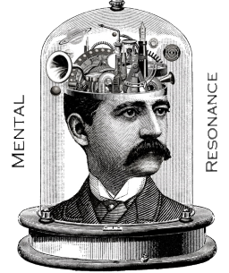

  

Dust NLP
========

dust-nlp is a small library for the Dust Actor framework that supports idiomatic interactions with large language models
(LLMs) and embedding engines. 

A test program (NewsPipelineTest) combines this repo with other Dust libraries to create a simple News reader which
1. Given a topic (e.g. 'Electric Vehicle Charging') will
2. Automatically find and verify good RSS feeds which are likely to have appropriate articles and then
3. Sets up a feed reader on each such feed. For retrieved Web pages it
4. Isolates the important content in the page and sees if it matches the given topic. If it does it
5. Displays a summary of the article.

Running the test on the topic above resulted in:

Title: Enel X Way North America ceases operations

Summary: Enel X Way North America planned to operate two million charging points in North America by 2030, including 10,000 fast chargers. However, the subsidiary of the Italian energy group Enel has abruptly announced its withdrawal from the US and Canada due to financial challenges and market dynamics. The shutdown includes discontinuing the Enel X Way software landscape, leaving customers without connectivity services and access to charging processes. ChargeLab has stepped in to take over the commercial network JuiceBox, offering migration options for affected commercial site hosts before Enel X Way servers are permanently disabled.
from /user/news/newspipe/

Title: EVgo loan for over $1 billion for network expansion in the US

Summary: EVgo plans to install 7,500 new electric vehicle chargers across ten states by 2030, in alignment with the National Electric Vehicle Infrastructure Formula Program. This initiative, supported by a partnership with the Biden-Harris administration, aims to enhance EV charging accessibility in communities in need. The expansion is expected to create over 1,000 jobs and is contingent on meeting specific technical, legal, environmental, and financial requirements. Additionally, EVgo recently partnered with General Motors to establish 400 fast-charging points with high capacity in key US metropolitan areas, with the first location set to open next year.
from /user/news/newspipe/

Title: Tesla shares Supercharger Network performance and growth stats in Q3 2024

Summary: In the third quarter of 2024, Tesla reported significant growth in its Supercharger Network, adding 2,800 stalls and delivering 1.4 TWh of energy, resulting in savings of over 150 million gallons of gasoline and offsetting more than 3 billion pounds of CO2. Industry watchers estimate that Tesla has built around 62,400 Superchargers globally. Despite initial concerns following layoffs in the Supercharger team, CEO Elon Musk reassured the community of continued network growth with a focus on achieving 100% uptime and expanding existing locations.
from /user/news/newspipe/

Title: Lightning fast charger: Fortescue 6 MW DCFC for electric heavy equipment

Summary: Fortescue and Liebherr have partnered to develop a groundbreaking 6 MW DC fast charger for massive haul trucks, capable of charging a 1,900 kWh battery in under 30 minutes. This charger is part of a $4 billion deal for 475 zero-emission Liebherr machines, including autonomous battery-electric trucks, electric excavators, and battery-powered loaders. The collaboration aims to decarbonize mining activities globally, with Fortescue's 2030 Real Zero target focusing on eliminating carbon emissions from Australian iron ore operations by 2030.
from /user/news/newspipe/

Title: Get your EV questions answered at Drive Electric Week, continuing thru Sunday

Summary: Drive Electric Week, organized by various associations, commenced with nearly 200 events both online and in-person, celebrating electric vehicles. The event, now in its 14th year, offers a platform for prospective EV buyers to engage with owners, sharing experiences and tips. Ranging from small meetups to larger festivals, these events provide insights into EV ownership, with some online sessions available. Check local listings for upcoming events and diverse EV showcases, as Drive Electric Week continues through Sunday, October 6.
from /user/news/newspipe/

Title: Caterpillar presents dynamic charging system for mining trucks

Summary: Caterpillar introduces Cat Dynamic Energy Transfer (DET) system for intermediate charging of battery-only and hybrid mining vehicles, featuring a power module, rail system for dynamic charging, and transfer arms. The mobile rail system can adapt to various mine layouts, allowing trucks to charge while driving uphill, enhancing uptime and operational efficiency. Caterpillar aims to reduce operating costs and emissions, offering flexibility for future needs. The system integrates with Cat MineStar Command for autonomous hauling, catering to the growing trend of large autonomous vehicles in mining operations.
from /user/news/newspipe/

... and a lot more. 